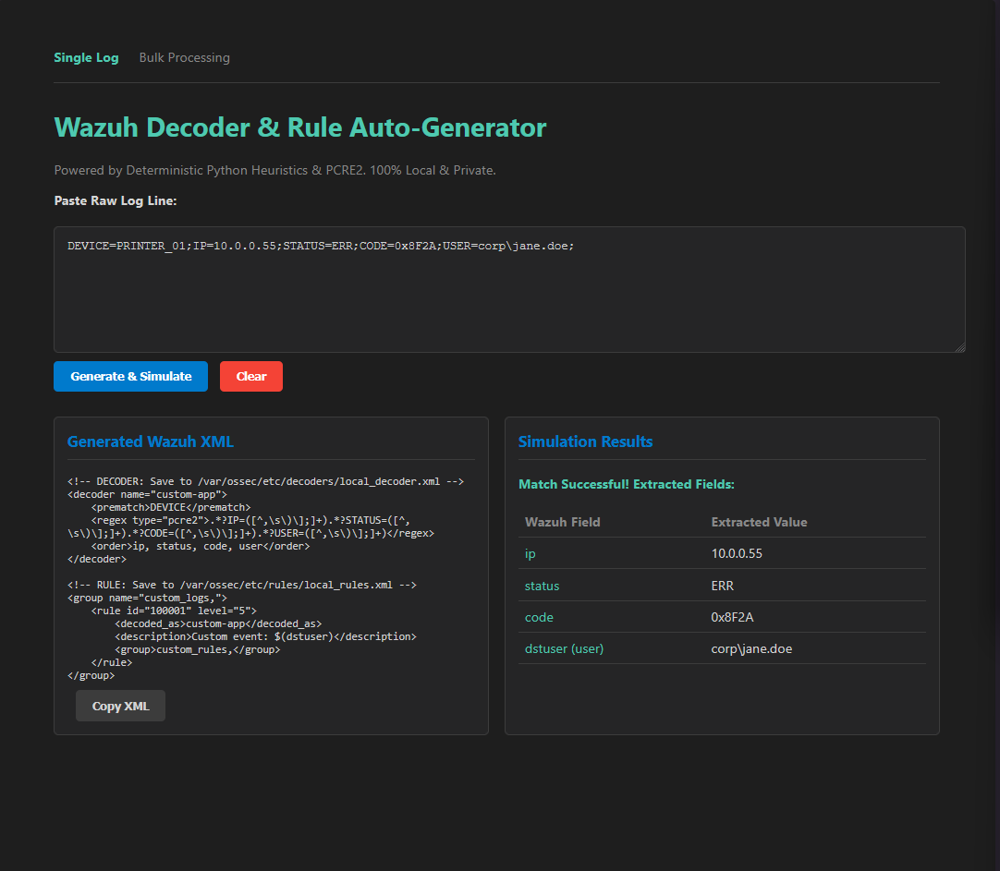
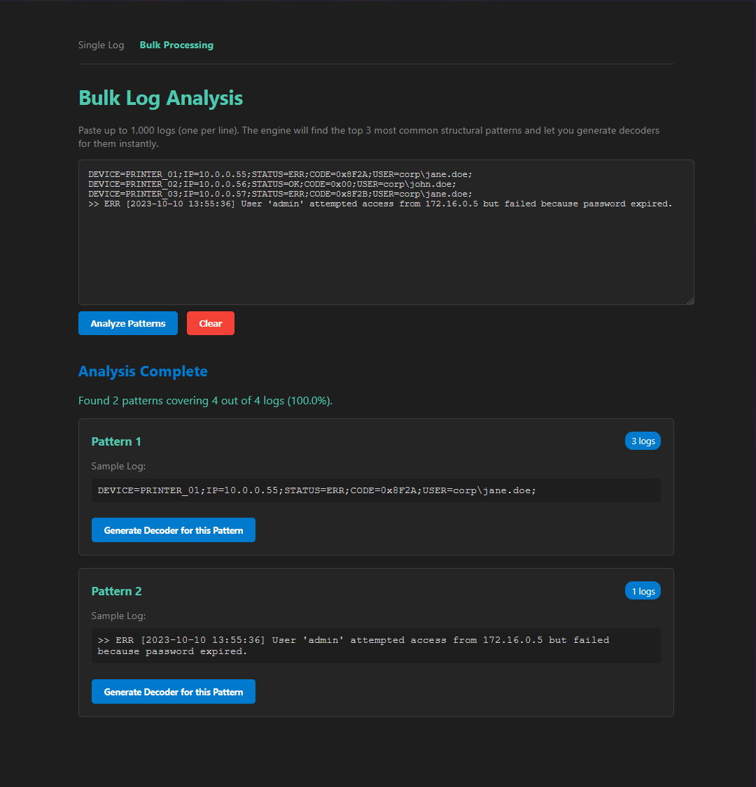
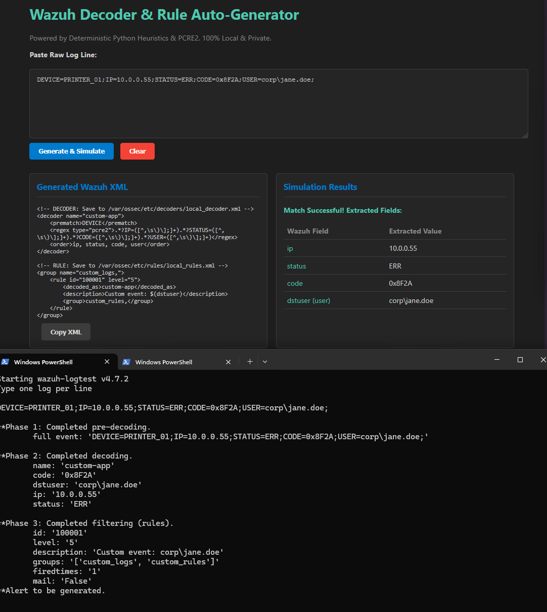

[](https://www.python.org/)
[](https://fastapi.tiangolo.com/)
[](https://www.docker.com/)
[](LICENSE)

# Wazuh Decoder & Rule Auto-Generator

A self-hosted, deterministic Python heuristic engine for generating Wazuh decoders. Paste raw, unstructured log lines and instantly generate syntactically perfect Wazuh `<decoder>` and `<rule>` XML configurations.


*The web UI generates XML and instantly simulates Wazuh extraction side-by-side.*

## Important Notice

This tool is designed for SOC analysts and sysadmins who need to parse proprietary, unstructured logs in Wazuh. It requires Docker to run. It is not a cloud SaaS; all log processing happens 100% locally to preserve data privacy.

## Key Features

*   **Bulk Log Analysis:** Paste 1,000 logs at once. The engine identifies the top 3 most common structural patterns and lets you generate decoders for them with one click.
*   **Instant In-App Simulation:** Generate the XML and instantly see a simulation of exactly what Wazuh will extract. No need to touch a terminal.
*   **Anchor & Bridge Architecture:** Uses PCRE2 `.*?` non-greedy bridging to effortlessly navigate complex punctuation, brackets, and proprietary log formats without breaking.
*   **Native Wazuh Compatibility:** Automatically maps extracted fields to native Wazuh variables (`user`, `srcip`, `dstip`) and uses `<regex type="pcre2">` for maximum compatibility.
*   **Zero Hallucinations:** Pure Python heuristics. No LLMs, no waiting, no API costs.

## The Architecture

Traffic is parsed using a Deterministic Python Heuristic Engine. Dynamic fields (IPs, Key-Value pairs) are identified using strict boundaries, and the static text between them is bridged using PCRE2 non-greedy matching (`.*?`).


*The Bulk Processing engine groups logs by structural signature to find the top 3 patterns.*


*Proof of concept: Generated XML injected directly into a Wazuh Manager, extracting fields perfectly in Phase 2 and firing custom rules in Phase 3.*

## Quick Start

**1. Clone the repo:**
```bash
git clone https://github.com/YOUR_USERNAME/wazuh-auto-generator.git
cd wazuh-auto-generator
```

**2. Start the application:**
```bash
docker compose up -d
```

**3. Open the UI:**
Navigate to `http://localhost:8000` in your browser.

## Deep-Dive Documentation

This README only covers the deployment. To understand *why* certain architectural decisions were made (like bypassing `re.escape()` to prevent Wazuh syntax errors, or fixing the Timestamp capture group bug), read the full Engineering Log:

**[Engineering Log & Architecture Deep Dive](docs/ARCHITECTURE.md)**

## License

This project is licensed under the MIT License. See the [LICENSE](LICENSE) file for details.
